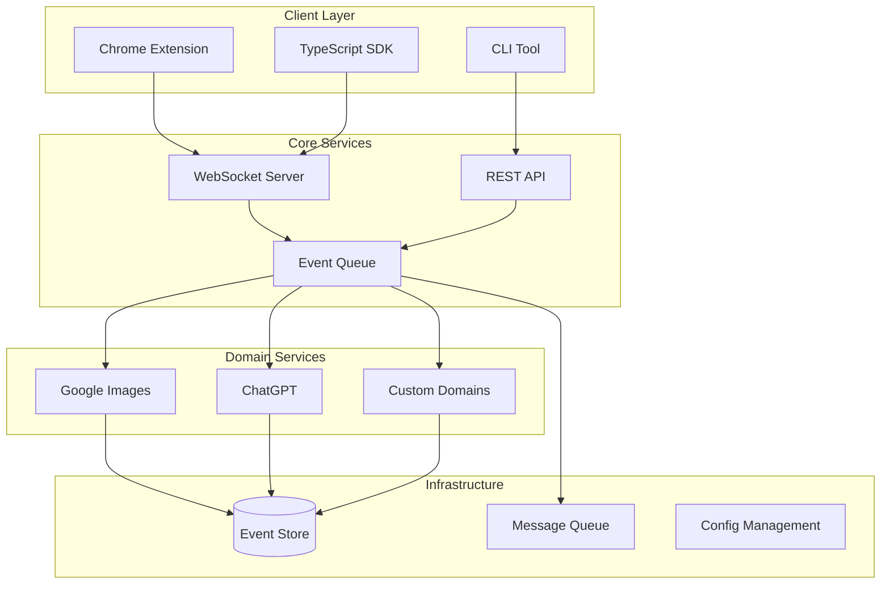

# Architecture Overview

Semantest is built on a foundation of modern software architecture principles, combining Domain-Driven Design (DDD), Event-Driven Architecture (EDA), and microservices patterns to create a robust, scalable, and maintainable testing framework.

## Core Principles

### 1. **Domain-Driven Design (DDD)**
- Each website/domain is treated as a bounded context
- Clear separation of concerns between domains
- Ubiquitous language for each domain

### 2. **Event-Driven Architecture (EDA)**
- Asynchronous, loosely coupled components
- Event sourcing for complete audit trails
- CQRS pattern for read/write optimization

### 3. **Microservices Architecture**
- Independent, deployable services
- Technology-agnostic communication
- Fault isolation and resilience

## System Components



## Key Architectural Decisions

### 1. TypeScript-First
- Type safety across the entire stack
- Shared types between frontend and backend
- Enhanced developer experience

### 2. Event-Driven Communication
- WebSocket for real-time bidirectional communication
- Event-based messaging for loose coupling
- Correlation IDs for request tracking

### 3. Security by Design
- Zero-trust architecture
- End-to-end encryption for sensitive data
- Comprehensive audit logging

### 4. Extensibility
- Plugin architecture for new domains
- Standardized interfaces
- Hot-reloadable modules

## Technology Stack

### Core Technologies
- **Language**: TypeScript 5.0+
- **Runtime**: Node.js 18+ LTS
- **Build**: Turborepo + esbuild
- **Testing**: Jest + Playwright

### Communication
- **Real-time**: WebSocket (Socket.io)
- **REST**: Express.js
- **Events**: EventEmitter + Redis Pub/Sub

### Storage
- **Event Store**: PostgreSQL with JSONB
- **Cache**: Redis
- **File Storage**: S3-compatible

### Infrastructure
- **Containers**: Docker
- **Orchestration**: Kubernetes
- **CI/CD**: GitHub Actions
- **Monitoring**: Prometheus + Grafana

## Design Patterns

### 1. Repository Pattern
```typescript
interface ImageRepository {
  save(image: Image): Promise<void>;
  findById(id: string): Promise<Image>;
  findByQuery(query: ImageQuery): Promise<Image[]>;
}
```

### 2. Event Sourcing
```typescript
interface DomainEvent {
  id: string;
  type: string;
  aggregateId: string;
  timestamp: Date;
  data: unknown;
  metadata: EventMetadata;
}
```

### 3. Command/Query Separation
```typescript
// Commands modify state
class DownloadImageCommand {
  constructor(
    public readonly url: string,
    public readonly options: DownloadOptions
  ) {}
}

// Queries read state
class GetImageStatusQuery {
  constructor(public readonly imageId: string) {}
}
```

## Scalability Considerations

### Horizontal Scaling
- Stateless services
- Load balancing with sticky sessions
- Database read replicas

### Performance Optimization
- Event batching
- Connection pooling
- Caching strategies

### Fault Tolerance
- Circuit breakers
- Retry mechanisms
- Graceful degradation

## Security Architecture

### Authentication & Authorization
- JWT-based authentication
- Role-based access control (RBAC)
- API key management

### Data Protection
- Encryption at rest and in transit
- PII anonymization
- GDPR compliance

### Audit & Compliance
- Comprehensive event logging
- Tamper-proof audit trails
- Compliance reporting

## Next Steps

- [Domain-Driven Design](./domain-driven-design) - Deep dive into DDD implementation
- [Event System](./event-system) - Understanding the event-driven architecture
- [Module Structure](./module-structure) - How modules are organized
- [Security](./security) - Security architecture and best practices