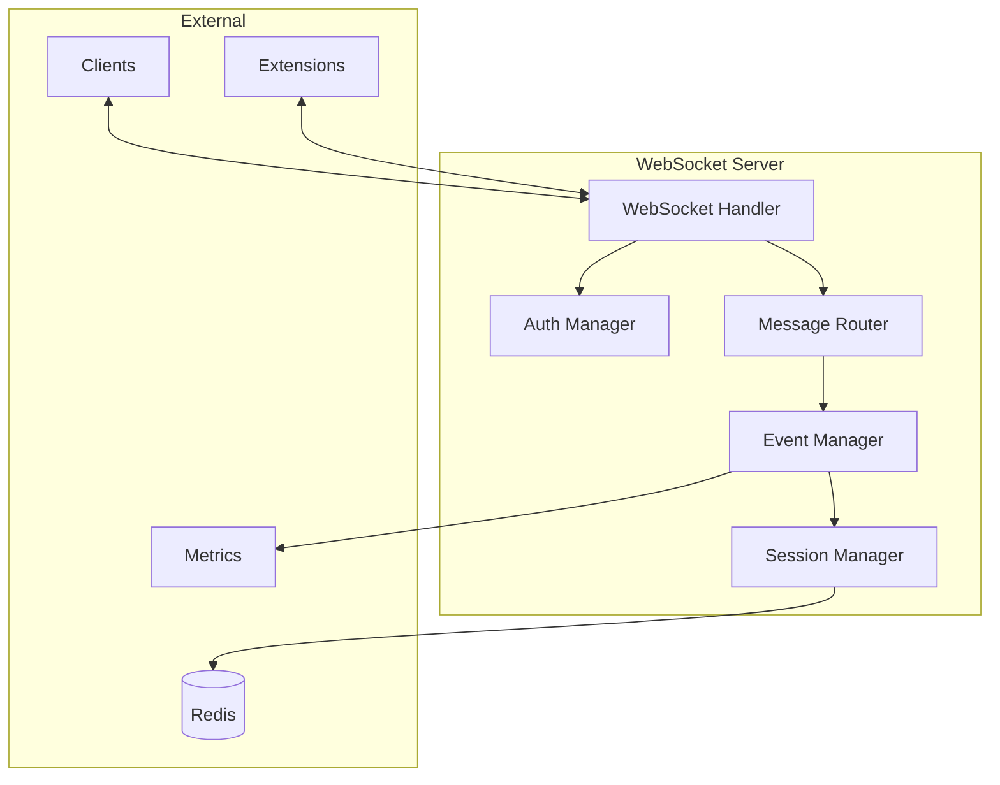

# WebSocket Server

The Semantest WebSocket Server is the central communication hub that orchestrates all automation activities. It provides real-time, bidirectional communication between clients and browser extensions.

## Overview

The WebSocket Server acts as:
- 🔄 **Message Broker** - Routes commands between clients and extensions
- 🔐 **Authentication Gateway** - Validates and authorizes connections
- 📊 **Event Processor** - Handles event streams and correlations
- 🏪 **State Manager** - Maintains session and automation state
- 📈 **Metrics Collector** - Tracks performance and usage

## Installation

### Using npm

```bash
# Install globally
npm install -g @semantest/server

# Run the server
semantest-server

# Or use npx
npx @semantest/server
```

### Using Docker

```bash
# Pull the official image
docker pull semantest/server:latest

# Run with default settings
docker run -p 3000:3000 semantest/server

# Run with custom configuration
docker run -p 3000:3000 \
  -e PORT=3000 \
  -e AUTH_ENABLED=true \
  -e REDIS_URL=redis://localhost:6379 \
  semantest/server
```

### From Source

```bash
# Clone the repository
git clone https://github.com/semantest/nodejs.server
cd nodejs.server

# Install dependencies
npm install

# Build the server
npm run build

# Start the server
npm start

# Development mode with hot reload
npm run dev
```

## Configuration

### Environment Variables

```bash
# Server Configuration
PORT=3000                          # WebSocket server port
HOST=0.0.0.0                      # Bind address

# Authentication
AUTH_ENABLED=true                  # Enable authentication
JWT_SECRET=your-secret-key        # JWT signing secret
API_KEY_HEADER=X-API-Key          # API key header name

# Redis Configuration
REDIS_URL=redis://localhost:6379   # Redis connection URL
REDIS_PASSWORD=                    # Redis password (if required)

# Logging
LOG_LEVEL=info                     # debug, info, warn, error
LOG_FORMAT=json                    # json, pretty

# Performance
MAX_CONNECTIONS=1000               # Maximum concurrent connections
MESSAGE_TIMEOUT=30000              # Message timeout (ms)
HEARTBEAT_INTERVAL=25000           # WebSocket heartbeat (ms)
```

### Configuration File

Create `config.json`:

```json
{
  "server": {
    "port": 3000,
    "host": "0.0.0.0",
    "cors": {
      "origin": "*",
      "credentials": true
    }
  },
  "auth": {
    "enabled": true,
    "jwt": {
      "secret": "your-secret-key",
      "expiresIn": "24h"
    },
    "apiKeys": {
      "enabled": true,
      "keys": ["key1", "key2"]
    }
  },
  "redis": {
    "url": "redis://localhost:6379",
    "keyPrefix": "semantest:"
  },
  "websocket": {
    "pingInterval": 25000,
    "pingTimeout": 60000,
    "maxPayload": 1048576
  }
}
```

## Architecture

### Core Components



### Message Flow

1. **Client connects** → Auth validation
2. **Client sends command** → Message routing
3. **Extension receives** → Command execution
4. **Extension responds** → Result routing
5. **Client receives result** → Connection maintained

## API Reference

### Connection

```typescript
import io from 'socket.io-client';

const socket = io('http://localhost:3000', {
  auth: {
    token: 'your-jwt-token'
  },
  transports: ['websocket']
});

socket.on('connect', () => {
  console.log('Connected to Semantest server');
});
```

### Authentication

#### JWT Authentication

```typescript
// Login to get token
const response = await fetch('http://localhost:3000/auth/login', {
  method: 'POST',
  headers: { 'Content-Type': 'application/json' },
  body: JSON.stringify({
    username: 'user',
    password: 'pass'
  })
});

const { token } = await response.json();

// Use token for WebSocket
const socket = io('http://localhost:3000', {
  auth: { token }
});
```

#### API Key Authentication

```typescript
const socket = io('http://localhost:3000', {
  auth: {
    apiKey: 'your-api-key'
  }
});
```

### Events

#### Client Events (Emit)

```typescript
// Send command to extension
socket.emit('command', {
  type: 'DOWNLOAD_IMAGE',
  target: { /* target details */ },
  options: { /* command options */ }
});

// Request server status
socket.emit('status');

// Ping for latency check
socket.emit('ping');
```

#### Server Events (Listen)

```typescript
// Command result
socket.on('result', (data) => {
  console.log('Command result:', data);
});

// Command progress
socket.on('progress', (data) => {
  console.log('Progress:', data.percent);
});

// Error events
socket.on('error', (error) => {
  console.error('Server error:', error);
});

// Status response
socket.on('status', (status) => {
  console.log('Server status:', status);
});
```

### Message Protocol

#### Command Message

```typescript
interface CommandMessage {
  id: string;                    // Unique command ID
  type: CommandType;             // Command type
  target: TargetDescriptor;      // Target element
  action: ActionDescriptor;      // Action to perform
  options?: CommandOptions;      // Optional parameters
  timeout?: number;              // Command timeout
  correlationId?: string;        // Request correlation
}
```

#### Result Message

```typescript
interface ResultMessage {
  id: string;                    // Command ID
  success: boolean;              // Success status
  data?: any;                    // Result data
  error?: ErrorInfo;             // Error details
  metadata: {                    // Execution metadata
    duration: number;
    timestamp: number;
    extension: string;
  };
}
```

## Advanced Features

### Session Management

```typescript
// Create named session
socket.emit('session:create', {
  name: 'my-automation',
  persistent: true
});

// Join existing session
socket.emit('session:join', {
  sessionId: 'session-123'
});

// Share session with other clients
socket.emit('session:share', {
  sessionId: 'session-123',
  permissions: ['read', 'write']
});
```

### Event Correlation

```typescript
// Send correlated commands
const correlationId = uuid();

socket.emit('command', {
  type: 'NAVIGATE',
  url: 'https://example.com',
  correlationId
});

socket.emit('command', {
  type: 'CLICK',
  target: { selector: 'button' },
  correlationId
});

// Receive correlated results
socket.on('result', (result) => {
  if (result.correlationId === correlationId) {
    console.log('Correlated result:', result);
  }
});
```

### Pub/Sub Channels

```typescript
// Subscribe to channels
socket.emit('subscribe', {
  channels: ['downloads', 'errors']
});

// Receive channel messages
socket.on('channel:downloads', (message) => {
  console.log('Download event:', message);
});

// Publish to channel
socket.emit('publish', {
  channel: 'custom-events',
  message: { type: 'info', data: 'test' }
});
```

## Monitoring

### Health Check Endpoint

```bash
curl http://localhost:3000/health
```

Response:
```json
{
  "status": "healthy",
  "uptime": 3600,
  "connections": {
    "clients": 5,
    "extensions": 2
  },
  "redis": "connected",
  "version": "1.0.0"
}
```

### Metrics Endpoint

```bash
curl http://localhost:3000/metrics
```

Prometheus-compatible metrics:
```
# HELP websocket_connections_total Total WebSocket connections
# TYPE websocket_connections_total counter
websocket_connections_total{type="client"} 150

# HELP websocket_messages_total Total messages processed
# TYPE websocket_messages_total counter
websocket_messages_total{direction="inbound"} 1500
```

## Security

### TLS/SSL Configuration

```javascript
// config.json
{
  "server": {
    "tls": {
      "enabled": true,
      "cert": "/path/to/cert.pem",
      "key": "/path/to/key.pem",
      "ca": "/path/to/ca.pem"
    }
  }
}
```

### Rate Limiting

```javascript
{
  "rateLimiting": {
    "enabled": true,
    "windowMs": 60000,      // 1 minute
    "maxRequests": 100,     // per window
    "message": "Too many requests"
  }
}
```

### CORS Configuration

```javascript
{
  "cors": {
    "origin": ["https://app.semantest.com"],
    "credentials": true,
    "methods": ["GET", "POST"],
    "allowedHeaders": ["Authorization", "X-API-Key"]
  }
}
```

## Scaling

### Horizontal Scaling with Redis

```javascript
// Enable Redis adapter for multi-instance
{
  "scaling": {
    "adapter": "redis",
    "redis": {
      "url": "redis://localhost:6379",
      "key": "semantest-io"
    }
  }
}
```

### Load Balancing

Using nginx:
```nginx
upstream semantest_servers {
    ip_hash;
    server server1:3000;
    server server2:3000;
    server server3:3000;
}

server {
    listen 80;
    location /socket.io/ {
        proxy_pass http://semantest_servers;
        proxy_http_version 1.1;
        proxy_set_header Upgrade $http_upgrade;
        proxy_set_header Connection "upgrade";
    }
}
```

## Troubleshooting

### Connection Issues
- Check firewall settings
- Verify WebSocket transport is allowed
- Ensure correct authentication
- Check CORS configuration

### Performance Issues
- Monitor connection count
- Check Redis latency
- Review message sizes
- Enable connection pooling

### Debugging

Enable debug mode:
```bash
DEBUG=semantest:* npm start
```

## Resources

- [API Documentation](/docs/api/websocket-protocol)
- [Client SDK Guide](/docs/components/sdk/client)
- [Deployment Guide](/docs/deployment/docker)
- [Security Best Practices](/docs/architecture/security)