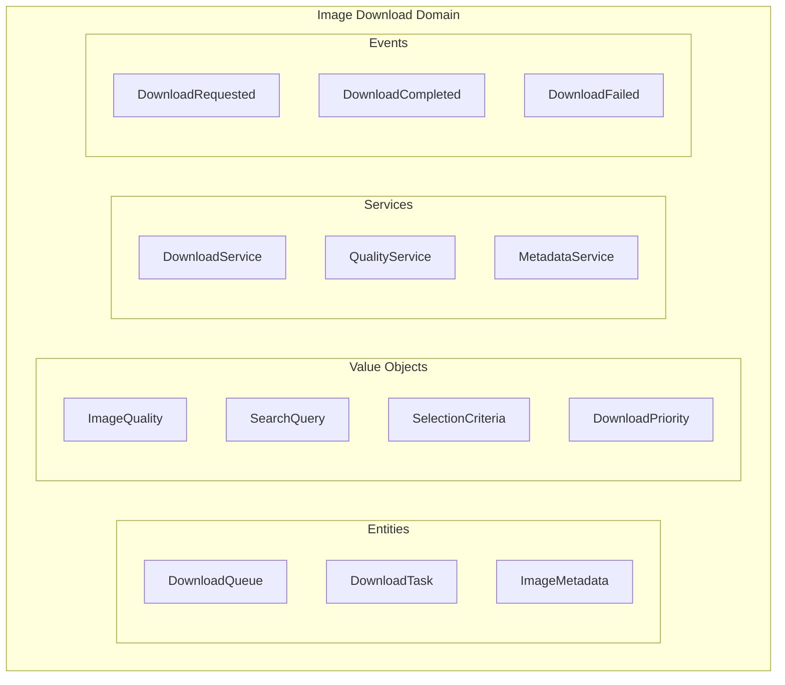

# Image Download Domain

The Image Download domain encapsulates all business logic related to discovering, selecting, and downloading images from web sources. It implements Domain-Driven Design principles to provide a clean, maintainable solution for semantic image acquisition.

## Domain Overview

The Image Download domain handles:
- **Image Discovery** - Finding images based on semantic criteria
- **Quality Assessment** - Evaluating and ranking images
- **Download Management** - Efficient concurrent downloading
- **Queue Processing** - Priority-based download queuing
- **Metadata Extraction** - Gathering comprehensive image information
- **Storage Coordination** - Organizing downloaded images

## Architecture



## Core Concepts

### Entities

#### DownloadQueue

The central aggregate root managing download operations:

```typescript
export class DownloadQueue extends AggregateRoot {
  private tasks: Map<TaskId, DownloadTask> = new Map();
  private priorityQueue: PriorityQueue<DownloadTask>;
  
  constructor(
    public readonly id: QueueId,
    private config: QueueConfig
  ) {
    super();
    this.priorityQueue = new PriorityQueue(
      (a, b) => a.priority.compare(b.priority)
    );
  }
  
  addTask(
    url: ImageUrl,
    criteria: SelectionCriteria,
    priority: DownloadPriority = DownloadPriority.NORMAL
  ): TaskId {
    const taskId = TaskId.generate();
    const task = new DownloadTask(taskId, url, criteria, priority);
    
    this.tasks.set(taskId, task);
    this.priorityQueue.enqueue(task);
    
    this.addEvent(new DownloadTaskAddedEvent(
      this.id,
      taskId,
      url.value,
      priority.value
    ));
    
    return taskId;
  }
  
  getNextTask(): DownloadTask | null {
    const task = this.priorityQueue.dequeue();
    if (task && this.canProcessTask(task)) {
      task.markInProgress();
      return task;
    }
    return null;
  }
  
  private canProcessTask(task: DownloadTask): boolean {
    const activeTasks = Array.from(this.tasks.values())
      .filter(t => t.isInProgress());
    
    return activeTasks.length < this.config.maxConcurrent;
  }
}
```

#### DownloadTask

Represents an individual download operation:

```typescript
export class DownloadTask extends Entity {
  private _status: TaskStatus = TaskStatus.PENDING;
  private _attempts = 0;
  private _result?: DownloadResult;
  
  constructor(
    id: TaskId,
    public readonly url: ImageUrl,
    public readonly criteria: SelectionCriteria,
    public readonly priority: DownloadPriority,
    public readonly createdAt: Date = new Date()
  ) {
    super(id);
  }
  
  markInProgress(): void {
    if (this._status !== TaskStatus.PENDING) {
      throw new InvalidStateError('Task must be pending to start');
    }
    this._status = TaskStatus.IN_PROGRESS;
    this._attempts++;
  }
  
  markCompleted(result: DownloadResult): void {
    this._status = TaskStatus.COMPLETED;
    this._result = result;
  }
  
  markFailed(error: Error): void {
    if (this._attempts < 3) {
      this._status = TaskStatus.PENDING; // Retry
    } else {
      this._status = TaskStatus.FAILED;
    }
  }
  
  canRetry(): boolean {
    return this._status === TaskStatus.FAILED && 
           this._attempts < 3;
  }
}
```

### Value Objects

#### ImageQuality

Immutable representation of image quality metrics:

```typescript
export class ImageQuality extends ValueObject {
  constructor(
    public readonly resolution: Resolution,
    public readonly format: ImageFormat,
    public readonly colorDepth: number,
    public readonly compression: CompressionLevel
  ) {
    super();
  }
  
  get score(): number {
    let score = 0;
    
    // Resolution scoring (0-40 points)
    score += Math.min(40, (this.resolution.pixels / 1_000_000) * 10);
    
    // Format scoring (0-30 points)
    score += this.format.qualityScore * 30;
    
    // Color depth scoring (0-20 points)
    score += Math.min(20, this.colorDepth / 24 * 20);
    
    // Compression scoring (0-10 points)
    score += (1 - this.compression.ratio) * 10;
    
    return Math.round(score);
  }
  
  meets(criteria: QualityCriteria): boolean {
    return this.resolution.pixels >= criteria.minResolution &&
           this.format.isSupported(criteria.formats) &&
           this.score >= criteria.minScore;
  }
}
```

#### SearchQuery

Encapsulates image search parameters:

```typescript
export class SearchQuery extends ValueObject {
  constructor(
    public readonly text: string,
    public readonly source: ImageSource,
    public readonly filters: SearchFilters = {}
  ) {
    super();
    this.validate();
  }
  
  private validate(): void {
    if (!this.text || this.text.trim().length === 0) {
      throw new ValidationError('Search text cannot be empty');
    }
    
    if (this.text.length > 200) {
      throw new ValidationError('Search text too long');
    }
  }
  
  withFilters(filters: SearchFilters): SearchQuery {
    return new SearchQuery(
      this.text,
      this.source,
      { ...this.filters, ...filters }
    );
  }
}
```

### Domain Services

#### DownloadService

Orchestrates the download process:

```typescript
export class DownloadService {
  constructor(
    private httpClient: HttpClient,
    private storage: StorageService,
    private eventBus: EventBus
  ) {}
  
  async download(task: DownloadTask): Promise<DownloadResult> {
    try {
      // Download image
      const imageData = await this.httpClient.download(
        task.url.value,
        {
          timeout: 30000,
          maxSize: 50 * 1024 * 1024 // 50MB
        }
      );
      
      // Extract metadata
      const metadata = await this.extractMetadata(imageData);
      
      // Validate against criteria
      if (!this.meetsCriteria(metadata, task.criteria)) {
        throw new ImageRejectedError('Does not meet criteria');
      }
      
      // Store image
      const storagePath = await this.storage.store(
        imageData,
        metadata
      );
      
      // Create result
      const result = new DownloadResult(
        task.id,
        storagePath,
        metadata,
        imageData.length
      );
      
      // Publish event
      await this.eventBus.publish(
        new ImageDownloadedEvent(
          task.id.value,
          task.url.value,
          storagePath
        )
      );
      
      return result;
      
    } catch (error) {
      await this.eventBus.publish(
        new DownloadFailedEvent(
          task.id.value,
          error.message
        )
      );
      throw error;
    }
  }
  
  private async extractMetadata(
    data: Buffer
  ): Promise<ImageMetadata> {
    // Implementation details...
  }
  
  private meetsCriteria(
    metadata: ImageMetadata,
    criteria: SelectionCriteria
  ): boolean {
    // Validation logic...
  }
}
```

#### QualityAssessmentService

Evaluates image quality:

```typescript
export class QualityAssessmentService {
  async assess(imageData: Buffer): Promise<ImageQuality> {
    const metadata = await sharp(imageData).metadata();
    
    const resolution = new Resolution(
      metadata.width!,
      metadata.height!
    );
    
    const format = ImageFormat.fromString(metadata.format!);
    
    const colorDepth = metadata.channels! * metadata.depth!;
    
    const compression = await this.estimateCompression(
      imageData,
      metadata
    );
    
    return new ImageQuality(
      resolution,
      format,
      colorDepth,
      compression
    );
  }
  
  rankImages(images: ImageCandidate[]): ImageCandidate[] {
    return images.sort((a, b) => 
      b.quality.score - a.quality.score
    );
  }
}
```

### Domain Events

Events emitted by the domain:

```typescript
export class DownloadRequestedEvent extends DomainEvent {
  constructor(
    public readonly queueId: string,
    public readonly taskId: string,
    public readonly url: string,
    public readonly priority: string
  ) {
    super();
  }
}

export class DownloadStartedEvent extends DomainEvent {
  constructor(
    public readonly taskId: string,
    public readonly attemptNumber: number
  ) {
    super();
  }
}

export class DownloadProgressEvent extends DomainEvent {
  constructor(
    public readonly taskId: string,
    public readonly bytesReceived: number,
    public readonly totalBytes: number
  ) {
    super();
  }
}

export class DownloadCompletedEvent extends DomainEvent {
  constructor(
    public readonly taskId: string,
    public readonly filePath: string,
    public readonly fileSize: number,
    public readonly duration: number
  ) {
    super();
  }
}

export class DownloadFailedEvent extends DomainEvent {
  constructor(
    public readonly taskId: string,
    public readonly error: string,
    public readonly willRetry: boolean
  ) {
    super();
  }
}
```

## Use Cases

### Download Images by Query

```typescript
export class DownloadImagesByQueryUseCase {
  constructor(
    private queue: DownloadQueueRepository,
    private searchService: ImageSearchService,
    private downloadService: DownloadService
  ) {}
  
  async execute(command: DownloadImagesCommand): Promise<void> {
    // Create search query
    const query = new SearchQuery(
      command.query,
      ImageSource.fromUrl(command.source),
      command.filters
    );
    
    // Search for images
    const candidates = await this.searchService.search(query);
    
    // Create selection criteria
    const criteria = new SelectionCriteria(
      command.quality,
      command.minResolution,
      command.formats
    );
    
    // Filter and rank candidates
    const selected = candidates
      .filter(c => c.meetsCriteria(criteria))
      .sort((a, b) => b.quality.score - a.quality.score)
      .slice(0, command.count);
    
    // Get or create queue
    const queue = await this.queue.findOrCreate();
    
    // Add download tasks
    for (const image of selected) {
      queue.addTask(
        image.url,
        criteria,
        this.determinePriority(command)
      );
    }
    
    // Save queue
    await this.queue.save(queue);
    
    // Start processing
    this.downloadService.processQueue(queue.id);
  }
}
```

### Process Download Queue

```typescript
export class ProcessDownloadQueueUseCase {
  constructor(
    private queue: DownloadQueueRepository,
    private downloadService: DownloadService,
    private eventBus: EventBus
  ) {}
  
  async execute(queueId: QueueId): Promise<void> {
    const queue = await this.queue.findById(queueId);
    if (!queue) throw new NotFoundError('Queue not found');
    
    while (true) {
      const task = queue.getNextTask();
      if (!task) break;
      
      try {
        await this.eventBus.publish(
          new DownloadStartedEvent(
            task.id.value,
            task.attempts
          )
        );
        
        const result = await this.downloadService.download(task);
        task.markCompleted(result);
        
        await this.eventBus.publish(
          new DownloadCompletedEvent(
            task.id.value,
            result.path,
            result.size,
            result.duration
          )
        );
        
      } catch (error) {
        task.markFailed(error);
        
        await this.eventBus.publish(
          new DownloadFailedEvent(
            task.id.value,
            error.message,
            task.canRetry()
          )
        );
      }
      
      await this.queue.save(queue);
    }
  }
}
```

## Testing

### Unit Tests

```typescript
describe('DownloadQueue', () => {
  let queue: DownloadQueue;
  
  beforeEach(() => {
    queue = new DownloadQueue(
      QueueId.generate(),
      { maxConcurrent: 5 }
    );
  });
  
  describe('addTask', () => {
    it('should add task with correct priority', () => {
      const taskId = queue.addTask(
        new ImageUrl('https://example.com/image.jpg'),
        new SelectionCriteria(),
        DownloadPriority.HIGH
      );
      
      const task = queue.getNextTask();
      expect(task?.id).toEqual(taskId);
      expect(task?.priority).toEqual(DownloadPriority.HIGH);
    });
    
    it('should respect priority order', () => {
      queue.addTask(url1, criteria, DownloadPriority.LOW);
      queue.addTask(url2, criteria, DownloadPriority.HIGH);
      queue.addTask(url3, criteria, DownloadPriority.NORMAL);
      
      const first = queue.getNextTask();
      expect(first?.url).toEqual(url2); // HIGH priority
    });
  });
});
```

### Integration Tests

```typescript
describe('DownloadImagesByQuery Integration', () => {
  let useCase: DownloadImagesByQueryUseCase;
  let eventBus: TestEventBus;
  
  beforeEach(() => {
    eventBus = new TestEventBus();
    useCase = new DownloadImagesByQueryUseCase(
      new InMemoryQueueRepository(),
      new MockSearchService(),
      new DownloadService(httpClient, storage, eventBus)
    );
  });
  
  it('should download images matching criteria', async () => {
    await useCase.execute({
      source: 'unsplash.com',
      query: 'sunset',
      count: 5,
      quality: 'high'
    });
    
    // Verify events
    const events = eventBus.publishedEvents;
    expect(events).toContainEqual(
      expect.objectContaining({
        type: 'DownloadRequestedEvent'
      })
    );
  });
});
```

## Configuration

```typescript
export interface ImageDownloadConfig {
  download: {
    maxConcurrent: number;
    timeout: number;
    maxFileSize: number;
    retryAttempts: number;
    retryDelay: number;
  };
  
  quality: {
    minScore: number;
    preferredFormats: ImageFormat[];
    minResolution: number;
  };
  
  storage: {
    basePath: string;
    organizeBy: 'date' | 'source' | 'flat';
    keepMetadata: boolean;
  };
}

// Default configuration
export const defaultConfig: ImageDownloadConfig = {
  download: {
    maxConcurrent: 5,
    timeout: 30000,
    maxFileSize: 50 * 1024 * 1024,
    retryAttempts: 3,
    retryDelay: 1000
  },
  quality: {
    minScore: 60,
    preferredFormats: ['webp', 'jpeg', 'png'],
    minResolution: 800 * 600
  },
  storage: {
    basePath: './downloads',
    organizeBy: 'date',
    keepMetadata: true
  }
};
```

## Best Practices

1. **Use Domain Events** for cross-boundary communication
2. **Encapsulate Business Logic** in domain services
3. **Validate Early** using value objects
4. **Maintain Aggregate Boundaries** for consistency
5. **Test Domain Logic** independently of infrastructure
6. **Use Repository Pattern** for persistence abstraction

## Resources

- [Domain-Driven Design](/docs/architecture/ddd)
- [Event-Driven Architecture](/docs/architecture/events)
- [Testing Domain Logic](/docs/developer-guide/testing#domain-testing)
- [API Reference](/docs/api/domains/image-download)