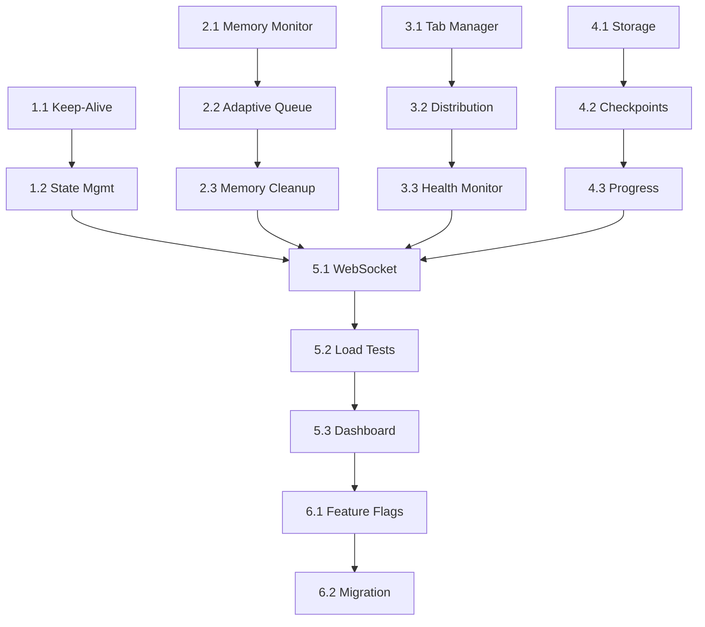

# REQ-003: Task Breakdown - Production-Scale Architecture Enhancements

**ID**: REQ-003-TASKS  
**Date**: 2025-07-22  
**Status**: READY  
**Epic**: Production-Scale Image Generation  

## Overview
Implementation tasks for enhancing the architecture to support 2000-3000 image generation operations.

## Task Breakdown by Component

### 1. Service Worker Lifecycle Manager [CRITICAL]

#### Task 1.1: Implement Keep-Alive System
**Priority**: P0  
**Estimated**: 2 days  
**Assignee**: Backend/Architect  
**Description**: Create multi-strategy keep-alive system to prevent service worker termination
```javascript
// Implement these strategies:
- chrome.runtime.sendMessage heartbeat
- chrome.storage.local timestamp updates  
- chrome.runtime.getPlatformInfo dummy calls
- chrome.alarms API periodic triggers
```
**Acceptance Criteria**:
- Service worker stays alive for 24+ hours
- Automatic recovery from unexpected termination
- < 1% CPU overhead from keep-alive

#### Task 1.2: Operation State Management
**Priority**: P0  
**Estimated**: 1 day  
**Assignee**: Backend  
**Description**: Track active operations and lifecycle state
**Acceptance Criteria**:
- Track operation start/end
- Persist state across restarts
- Clean shutdown on operation completion

### 2. Memory-Aware Processing Pipeline [CRITICAL]

#### Task 2.1: Memory Monitoring System
**Priority**: P0  
**Estimated**: 2 days  
**Assignee**: Performance  
**Description**: Implement real-time memory pressure detection
```javascript
// Monitor:
- JS heap usage via performance.memory
- Chrome process memory
- Available system memory
```
**Acceptance Criteria**:
- Accurate memory usage reporting
- Configurable thresholds (default 80%)
- < 100ms detection latency

#### Task 2.2: Adaptive Processing Queue
**Priority**: P0  
**Estimated**: 3 days  
**Assignee**: Backend/Performance  
**Description**: Queue that adapts to memory pressure
**Acceptance Criteria**:
- Pause processing at 80% memory
- Resume at 60% memory
- Graceful degradation under pressure
- Zero data loss

#### Task 2.3: Memory Cleanup Strategies
**Priority**: P1  
**Estimated**: 1 day  
**Assignee**: Performance  
**Description**: Implement aggressive memory reclamation
**Acceptance Criteria**:
- Clear browser caches safely
- Remove old checkpoints
- Force garbage collection
- Free 20%+ memory on demand

### 3. Distributed Tab Orchestrator [HIGH]

#### Task 3.1: Multi-Tab Manager
**Priority**: P1  
**Estimated**: 3 days  
**Assignee**: Frontend/Backend  
**Description**: Create and manage multiple ChatGPT worker tabs
```javascript
// Features:
- Spawn 1-10 worker tabs
- Pin tabs to prevent closure
- Health monitoring per tab
- Load balancing
```
**Acceptance Criteria**:
- Create tabs with 2s stagger
- Monitor tab health
- Redistribute on failure
- Clean shutdown

#### Task 3.2: Task Distribution Engine
**Priority**: P1  
**Estimated**: 2 days  
**Assignee**: Backend  
**Description**: Intelligently distribute tasks across workers
**Acceptance Criteria**:
- Round-robin with health awareness
- Automatic failover
- Priority queue support
- Even load distribution

#### Task 3.3: Worker Health Monitoring
**Priority**: P1  
**Estimated**: 2 days  
**Assignee**: QA/Backend  
**Description**: Track worker health and performance
**Acceptance Criteria**:
- Response time tracking
- Success rate per worker
- Automatic unhealthy worker removal
- Health recovery detection

### 4. Persistent State Management [HIGH]

#### Task 4.1: Redundant Storage System
**Priority**: P0  
**Estimated**: 2 days  
**Assignee**: Backend  
**Description**: Triple-redundant state storage
```javascript
// Storage layers:
1. chrome.storage.local (fast, limited)
2. IndexedDB (slow, unlimited)
3. sessionStorage (crash recovery)
```
**Acceptance Criteria**:
- Write to all 3 stores
- Read with fallback chain
- Handle storage quota errors
- Data consistency checks

#### Task 4.2: Checkpoint System Enhancement
**Priority**: P0  
**Estimated**: 2 days  
**Assignee**: Backend/QA  
**Description**: Comprehensive checkpoint/recovery
**Acceptance Criteria**:
- Save every 50 images
- Include full operation state
- Compress old checkpoints
- Resume < 30 seconds

#### Task 4.3: Progress Tracking System
**Priority**: P1  
**Estimated**: 1 day  
**Assignee**: Frontend  
**Description**: Real-time progress monitoring
**Acceptance Criteria**:
- Accurate completion percentage
- ETA calculation
- Per-worker statistics
- Historical metrics

### 5. Integration & Testing [CRITICAL]

#### Task 5.1: WebSocket Enhancement
**Priority**: P0  
**Estimated**: 2 days  
**Assignee**: Backend/Extension-Dev  
**Description**: Extend WebSocket for bulk operations
**Acceptance Criteria**:
- Handle bulk requests
- Progress streaming
- Error aggregation
- Graceful disconnection

#### Task 5.2: Load Testing Suite
**Priority**: P0  
**Estimated**: 3 days  
**Assignee**: QA  
**Description**: Comprehensive load testing
```bash
# Test scenarios:
- 100 images (baseline)
- 1000 images (stress)
- 3000 images (production)
- Memory pressure simulation
- Service worker termination
```
**Acceptance Criteria**:
- Automated test execution
- Performance metrics collection
- Failure scenario testing
- Regression prevention

#### Task 5.3: Monitoring Dashboard
**Priority**: P1  
**Estimated**: 2 days  
**Assignee**: Frontend  
**Description**: Real-time operation monitoring
**Acceptance Criteria**:
- Live progress visualization
- Worker status display
- Memory usage graphs
- Error log viewer

### 6. Rollout & Migration [MEDIUM]

#### Task 6.1: Feature Flag System
**Priority**: P2  
**Estimated**: 1 day  
**Assignee**: Backend  
**Description**: Gradual rollout control
**Acceptance Criteria**:
- Enable/disable new features
- A/B testing support
- Remote configuration
- Instant rollback

#### Task 6.2: Migration Guide
**Priority**: P2  
**Estimated**: 1 day  
**Assignee**: Scribe  
**Description**: User migration documentation
**Acceptance Criteria**:
- Step-by-step upgrade guide
- Troubleshooting section
- Performance tuning tips
- FAQ section

## Task Dependencies



## Sprint Planning

### Sprint 1 (Week 1): Foundation
- Task 1.1: Keep-Alive System
- Task 2.1: Memory Monitoring
- Task 4.1: Redundant Storage
- **Goal**: Prevent data loss

### Sprint 2 (Week 2): Distribution
- Task 3.1: Multi-Tab Manager
- Task 3.2: Distribution Engine
- Task 3.3: Health Monitoring
- **Goal**: Enable parallelization

### Sprint 3 (Week 3): Integration
- Task 5.1: WebSocket Enhancement
- Task 2.2: Adaptive Queue
- Task 4.2: Checkpoint Enhancement
- **Goal**: Connect all systems

### Sprint 4 (Week 4): Polish & Test
- Task 5.2: Load Testing
- Task 5.3: Monitoring Dashboard
- Task 6.1: Feature Flags
- **Goal**: Production readiness

## Risk Mitigation

### High-Risk Areas
1. **Service Worker Termination**: Multiple keep-alive strategies
2. **Memory Exhaustion**: Adaptive processing with hard limits
3. **Tab Crashes**: Automatic task redistribution
4. **State Loss**: Triple-redundant storage

### Contingency Plans
- Fallback to single-tab mode if orchestration fails
- Manual checkpoint recovery tools
- Emergency memory dump capability
- Gradual rollout with instant rollback

## Success Metrics

### Performance KPIs
- **Throughput**: 15+ images/minute with 5 workers
- **Reliability**: 99.9% success rate
- **Memory**: < 70% peak usage
- **Recovery**: < 30 seconds from any failure

### Quality Metrics
- Zero data loss incidents
- 100% checkpoint recovery success
- < 1% service worker terminations
- 95%+ user satisfaction

## Team Assignments

- **Architect**: Tasks 1.1, 3.1, overall coordination
- **Backend**: Tasks 1.2, 2.2, 3.2, 4.1, 4.2, 5.1
- **Frontend**: Tasks 3.1, 4.3, 5.3
- **Performance**: Tasks 2.1, 2.3
- **QA**: Tasks 3.3, 4.2, 5.2
- **Scribe**: Task 6.2
- **Extension-Dev**: Task 5.1 (WebSocket coordination)

## Definition of Done

Each task is complete when:
1. Code implemented and tested
2. Unit tests passing (>80% coverage)
3. Integration tests passing
4. Performance benchmarks met
5. Documentation updated
6. Code review approved
7. Deployed to staging environment

---

**Next Steps**: 
1. Team review and estimation refinement
2. Sprint 1 kickoff
3. Set up tracking dashboard