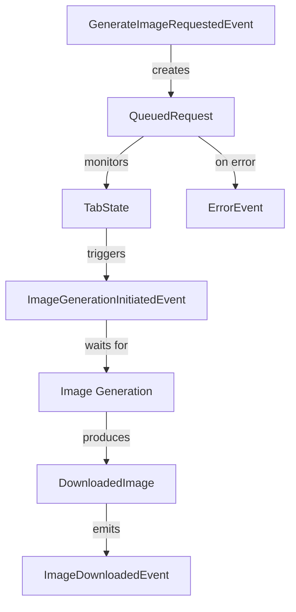
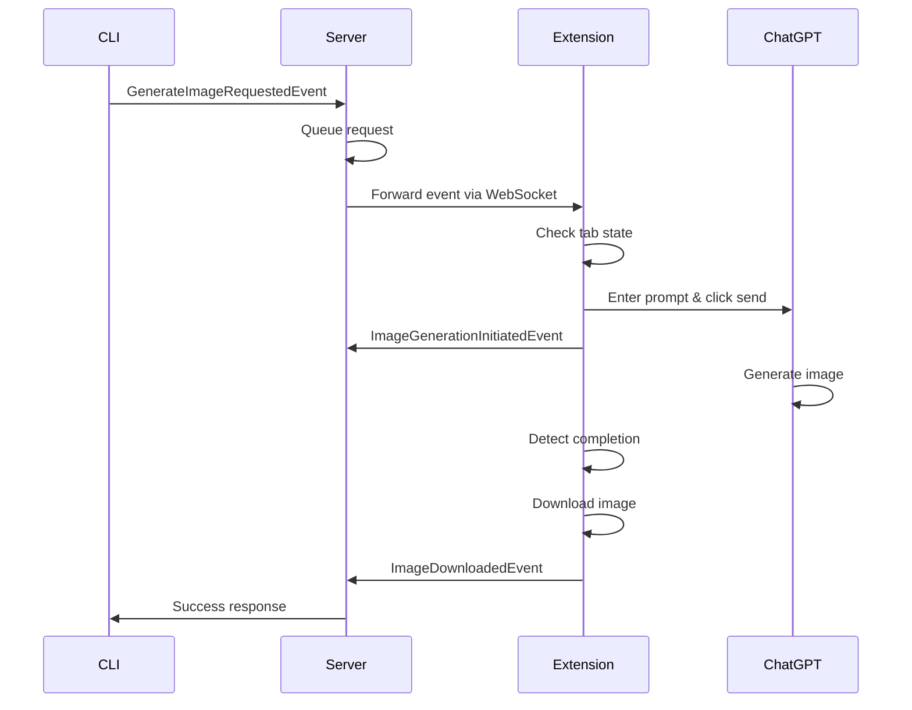

# Data Model: Image Generation via Browser Automation

## Core Entities

### GenerateImageRequestedEvent
```typescript
interface GenerateImageRequestedEvent {
  type: 'GenerateImageRequestedEvent';
  correlationId: string;  // UUID for tracking request through system
  timestamp: Date;
  payload: {
    prompt: string;         // Text prompt for image generation (max 1000 chars)
    fileName: string;       // Desired filename (without path)
    downloadFolder: string; // Absolute path to download directory
    domainName: string;     // Text-to-image tool domain (e.g., 'chatgpt.com')
  };
}
```

**Validation Rules**:
- `prompt`: Required, 1-1000 characters, sanitized for XSS
- `fileName`: Required, OS-safe characters only, max 255 chars
- `downloadFolder`: Required, absolute path, must exist and be writable
- `domainName`: Required, must be in supported domains list

### ImageGenerationInitiatedEvent
```typescript
interface ImageGenerationInitiatedEvent {
  type: 'ImageGenerationInitiatedEvent';
  correlationId: string;  // Links back to original request
  timestamp: Date;
  payload: {
    promptSubmitted: string;  // Actual prompt sent to tool
    tabId: string;           // Browser tab identifier
    estimatedTime?: number;  // Estimated seconds to completion
  };
}
```

**Validation Rules**:
- `correlationId`: Required, must match existing request
- `promptSubmitted`: Required, may differ slightly from original
- `tabId`: Required, valid browser tab ID

### ImageDownloadedEvent
```typescript
interface ImageDownloadedEvent {
  type: 'ImageDownloadedEvent';
  correlationId: string;  // Links back to original request
  timestamp: Date;
  payload: {
    filePath: string;      // Full path to downloaded file
    fileSize: number;      // Size in bytes
    mimeType: string;      // Image MIME type
    downloadTime: number;  // Milliseconds taken to download
  };
}
```

**Validation Rules**:
- `filePath`: Required, must be absolute path to existing file
- `fileSize`: Required, positive integer, max 50MB (52428800 bytes)
- `mimeType`: Required, must be valid image MIME type
- `downloadTime`: Required, positive integer

### ErrorEvent
```typescript
interface ErrorEvent {
  type: 'ErrorEvent';
  correlationId?: string;  // Optional, links to request if applicable
  timestamp: Date;
  payload: {
    code: ErrorCode;
    message: string;
    context?: Record<string, any>;
    recoverable: boolean;
  };
}

enum ErrorCode {
  CONNECTION_LOST = 'CONNECTION_LOST',
  TAB_NOT_FOUND = 'TAB_NOT_FOUND',
  TIMEOUT = 'TIMEOUT',
  DOWNLOAD_FAILED = 'DOWNLOAD_FAILED',
  PERMISSION_DENIED = 'PERMISSION_DENIED',
  INVALID_INPUT = 'INVALID_INPUT',
  RATE_LIMITED = 'RATE_LIMITED',
  UNKNOWN = 'UNKNOWN'
}
```

## Supporting Entities

### TabState
```typescript
interface TabState {
  tabId: string;
  url: string;
  domain: string;
  isIdle: boolean;        // Can accept new prompts
  isGenerating: boolean;  // Currently generating image
  lastActivity: Date;
}
```

**State Transitions**:
- `idle` → `busy` (when prompt submitted)
- `busy` → `generating` (when generation starts)
- `generating` → `idle` (when generation completes)

### QueuedRequest
```typescript
interface QueuedRequest {
  request: GenerateImageRequestedEvent;
  status: QueueStatus;
  attempts: number;
  queuedAt: Date;
  startedAt?: Date;
  completedAt?: Date;
  error?: ErrorEvent;
}

enum QueueStatus {
  PENDING = 'PENDING',
  PROCESSING = 'PROCESSING',
  COMPLETED = 'COMPLETED',
  FAILED = 'FAILED',
  TIMEOUT = 'TIMEOUT'
}
```

**State Transitions**:
- `PENDING` → `PROCESSING` (when dequeued)
- `PROCESSING` → `COMPLETED` (on success)
- `PROCESSING` → `FAILED` (on error)
- `PROCESSING` → `TIMEOUT` (after 5 minutes)

### DownloadedImage
```typescript
interface DownloadedImage {
  correlationId: string;
  originalUrl: string;
  localPath: string;
  fileName: string;
  fileSize: number;
  mimeType: string;
  downloadedAt: Date;
  metadata?: {
    width?: number;
    height?: number;
    format?: string;
  };
}
```

## Relationships



## Data Persistence

### In-Memory Storage
- **Request Queue**: Array of QueuedRequest (max 100 items)
- **Tab States**: Map<tabId, TabState>
- **Active Requests**: Map<correlationId, QueuedRequest>

### File System Storage
- **Downloaded Images**: Stored at user-specified paths
- **Event Log**: Optional JSON event stream for debugging

## Constraints

### Business Rules
1. Only one request per tab at a time
2. Requests processed in FIFO order
3. Failed requests retry up to 3 times
4. Timeout after 5 minutes of no activity
5. Maximum queue size of 100 requests

### Technical Constraints
1. File names must be unique (append timestamp if collision)
2. Download folder must have write permissions
3. Maximum image size 50MB
4. Supported domains initially only 'chatgpt.com'
5. WebSocket message size limit 1MB

## Event Flow Sequence

